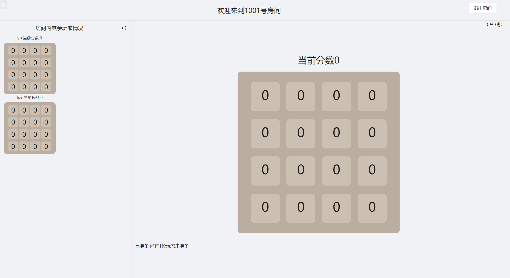
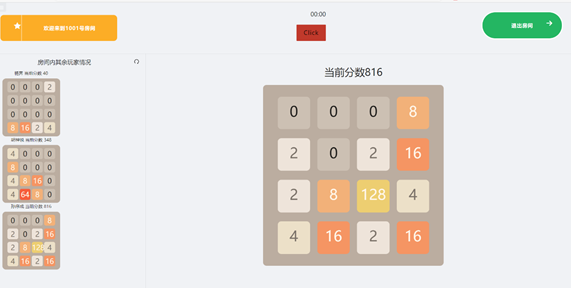

# 字节跳动飞书训练营

# 多人在线2048

------

## 项目概况


## 项目展示

### 登录/注册：


### 游戏大厅：


### 多人游戏：






## 运行项目

### 启动Spring boot

```
启动Spring boot
```

### 安装依赖库

```
cd react_2048
npm install
```

### 本地开发模式

```
npm run start
localhost:3000
```


## 鸣谢：

[yb12138 (github.com)](https://github.com/yb12138)

[jason-sun0123 (github.com)](https://github.com/jason-sun0123)